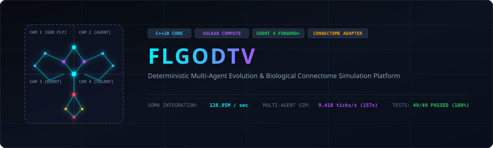
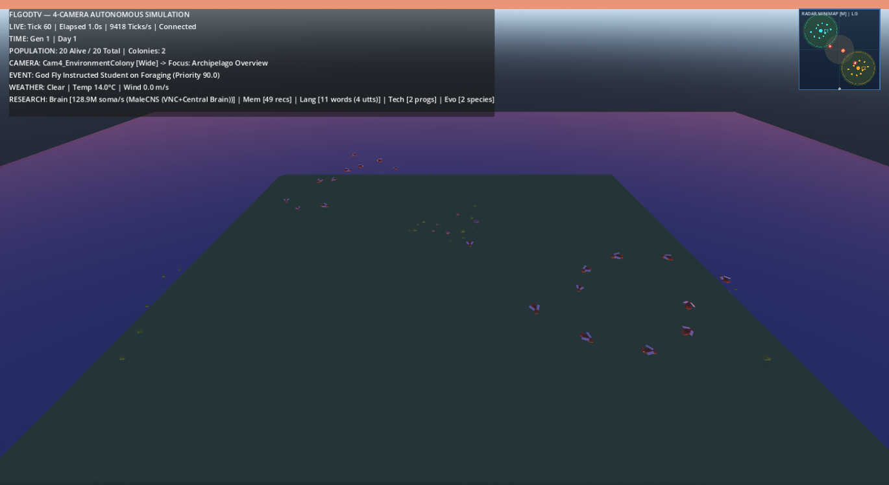
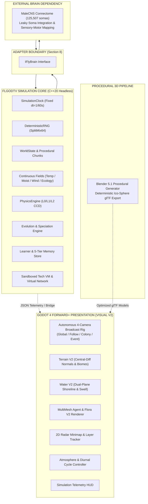

<p align="center">
  
</p>

<p align="center">
  <a href="https://github.com/timfromhcs/flgodtv/actions/workflows/ci.yml"></a>
  
  
  
  
   
  
  <a href="#license"></a>
</p>

---

## Overview

**FLGODTV** is a deterministic, local-first, headless-capable simulation platform uniting biological connectome neural modeling (*Drosophila melanogaster* male central nervous system), continuous procedural world generation, multi-agent evolution, and an autonomous 4-camera Godot 4 Forward+ Vulkan presentation frontend.

The platform executes entirely independent of rendering. A C++20 simulation core maintains canonical state across physics, continuous world fields, genetics, multi-tier memory, sandboxed technology execution, and neural somatic leaky integration. Godot 4 and Blender procedural assets serve strictly as presentation consumers over clean adapter boundaries.

---

## Visual Presentation & Telemetry

<p align="center">
  
</p>
<p align="center"><em>Automated headless verification capture: Quad-viewport autonomous broadcast rig (Global Overview, Fly Follow, Colony POV, Event Cam) with live simulation telemetry HUD.</em></p>

---

## Table of Contents

- [Highlights](#highlights)
- [Quick Start: Standalone Release](#quick-start-standalone-release)
- [Quick Start: Developer Build](#quick-start-developer-build)
- [Architecture](#architecture)
- [Verified Benchmarks](#verified-benchmarks)
- [Testing & Verification](#testing--verification)
- [Blender 3D Procedural Pipeline](#blender-3d-procedural-pipeline)
- [Deterministic Reproducibility](#deterministic-reproducibility)
- [Repository Layout](#repository-layout)
- [Known Hardware Boundaries](#known-hardware-boundaries)
- [Release Checksums](#release-checksums)
- [Evidence & Documentation](#evidence--documentation)
- [License & Scientific Attribution](#license--scientific-attribution)

---

## Highlights

- **Biological Connectome Baseline:** Directly ingests 125,507 reconstructed somas from the MaleCNS connectome (`malecns/data-raw/2023-27-2 soma_sides.csv`). Rate-coded leaky somatic integration runs at **128.95M somas / sec** (~129x realtime at 100 Hz).
- **Deterministic Core & Real-Time Physics:** C++20 engine with partitioned SplitMix64 PRNG streams, multi-tier L0/L1/L2 rigid body physics with continuous collision detection, and verified bit-exact midpoint crash recovery.
- **Procedural Continuous World:** Multi-octave fBm terrain elevation, continuous 2D scalar fields (temperature, moisture, wind, water, fire, ecology), and dynamic diurnal weather cycles.
- **Multi-Agent Genetics & Speciation:** 8-trait genome, 6 mutation operators, 2-parent crossover, phenotypic divergence tracking, and multi-colony social dynamics.
- **Autonomous 4-Camera Presentation Rig:** Real-time cinematic camera director switching between Global Overview, Follow Fly, Colony POV, and Best-Of Event cameras with dynamic weight scoring.
- **Blender 3D Procedural Content Pipeline:** Headless asset generator producing optimized glTF models (`fly_agent.glb`, `flora_shrub.glb`, `environment_rock.glb`) with **100% bit-exact SHA-256 replication**.
- **Godot 4 Forward+ Visual V2 Presentation:** Slope-aware central-difference terrain normals, dual-plane water with shoreline foam fringe and wave swell, multi-species botanical flora & hillside rock clusters, high-frequency wing oscillation & flight banking, 2D radar minimap with layer toggles, and dynamic 4-phase diurnal day/night atmospheric cycle.
- **Sandboxed Technology VM:** Isolated 8-register virtual machine with bounded cycle execution and packet-routed virtual network interfaces—zero host privilege exposure.

---

## Quick Start: Standalone Release

End users do **not** need a C++ compiler, CMake, Ninja, Python, Blender, or Godot. Standalone release packages bundle all runtime binaries, assets, and presentation layers:

### Option A: Windows Installer (Recommended)
1. Download `FLGODTV-0.1.0-Setup.exe` from the latest release.
2. Run the installer (supports custom target directory, desktop shortcut, and uninstaller).
3. Launch **FLGODTV** from your Start menu or desktop shortcut.

### Option B: Windows Portable ZIP
1. Download and extract `FLGODTV-0.1.0-windows-x64-portable.zip`.
2. Double-click `FLGODTV.bat` to launch the frontend and simulation bridge.

### Option C: Linux Portable
1. Download and extract `FLGODTV-0.1.0-linux-x64-portable.tar.gz`.
2. Execute `./run_flgodtv.sh`.

```bash
# Verify release package cryptographic integrity
sha256sum -c release/checksums/SHA256SUMS.txt
```

---

## Quick Start: Developer Build

### Prerequisites

| Tool | Minimum Version | Purpose |
| :--- | :--- | :--- |
| **C++ Compiler** | MSVC 19.38+ / GCC 12+ / Clang 16+ | C++20 core simulation build |
| **CMake** | 3.20+ | Cross-platform build system |
| **Ninja** | 1.11+ | High-speed parallel build driver |
| **Vulkan SDK** | 1.3+ / 1.4+ (with `glslc`) | Compute backend & SPIR-V compilation |
| **Python** | 3.10+ | Procedural pipeline & release packaging |
| **Godot Engine** *(Optional)* | 4.7+ Forward+ | Visual presentation & UI |
| **Blender** *(Optional)* | 5.1+ | Procedural 3D model generation |

### Step-by-Step Compilation

```bash
# 1. Clone repository with recursive submodules (MaleCNS dataset)
git clone --recursive https://github.com/timfromhcs/flgodtv.git
cd flgodtv

# 2. Configure using CMake Presets (Ninja Release)
cmake --preset ninja-release

# 3. Build the core headless simulation executable
cmake --build build/ninja-release --config Release

# 4. Execute the complete test suite (55/53 automated tests: 55 with Godot + display, 53 headless C++)
ctest --test-dir build/ninja-release --output-on-failure

# 5. Run headless simulation verification modes
./build/ninja-release/flgod --self-test
./build/ninja-release/flgod --simulate 600
./build/ninja-release/flgod --benchmark

# 6. Launch the Godot 4 Forward+ presentation frontend
godot --path godot/
```

---

## Architecture

The system enforces strict architectural boundaries: the simulation core never depends on Godot or visual rendering.



---

## Verified Benchmarks

All benchmark figures were recorded from executed binary runs on **AMD Ryzen 7 7735HS (8C/16T)** with **AMD Radeon Graphics (RDNA2 0x1681)** under Windows 11 x64:

| Subsystem | Workload / Metric | Verified Throughput | Realtime Factor |
| :--- | :--- | :--- | :--- |
| **MaleCNS Fly-Brain** | Leaky Soma Updates (125k somas) | **128.95M somas / sec** | **~129x** at 100 Hz |
| **Multi-Agent Ecosystem** | 20 Agents, 4 Colonies, Full Ecology | **9,418.45 ticks / sec** | **~157x** at 60 Hz |
| **Simulation Core** | Clock, PRNG & State Step | **28,078,845 ticks / sec** | **~467,981x** at 60 Hz |
| **Programmable Tech VM** | Sandboxed Virtual Instruction Cycle | **121.61 MIPS** | — |
| **Virtual Device Network** | Packet Routing & Arbiter | **5,418,204 packets / sec** | — |
| **Language System** | Utterance & Symbol Mapping | **16,706,762 utterances / sec**| — |
| **LLM Action Security** | 5-Stage Sandbox Gate Validation | **170,387 validations / sec**| — |
| **Vulkan Host &rarr; Device**| Unified Memory Transfer Bandwidth | **28,764 MB / sec** | — |

Raw JSON experiment manifests and execution logs are preserved in [`evidence/windows/`](evidence/windows/).

---

## Testing & Verification

The automated CTest suite executes **55 test targets** (53 C++ headless/GPU tests + 2 Godot presentation tests requiring a display and Vulkan GPU; 53 when Godot is absent). The machine-readable inventory is generated from `CMakeLists.txt` in [`evidence/testing/test_inventory.json`](evidence/testing/test_inventory.json):

```bash
ctest --test-dir build/ninja-release --output-on-failure
```

```text
100% tests passed out of 55
Total Test time (real) = ~13.1 sec
```

| Test Target | Validation Scope |
| :--- | :--- |
| `DeterministicSimulationTest` | Bit-exact state hash replication across independent executions |
| `DeterministicPhysicsTest` | 500-step trajectory match & 100% midpoint crash recovery hash match |
| `DeterministicWorldTest` | Multi-octave fBm procedural terrain and continuous field determinism |
| `DeterministicCameraTest` | Bit-exact camera pose replication over 150 simulation ticks |
| `EvolutionPopulationTest` | 25-generation genetic drift, speciation isolation, and migration tracking |
| `VulkanComputeTest` | Bit-exact numerical match (0.0 absolute difference) with CPU reference |
| `TelemetryHUDTest` | Live simulation telemetry extraction with strict "N/A" fallback safety |
| `GodotFrontendSmokeTest` | Headless validation of 4-camera rig, MultiMesh instancing, and UI capture |
| `GodotVisualV2VerificationTest` | Autonomous headless verification of Visual V2 terrain, water, vegetation, minimap, and day/night cycle |

---

## Blender 3D Procedural Pipeline

The procedural 3D content pipeline ([`scripts/blender_asset_generator.py`](scripts/blender_asset_generator.py)) executes headlessly via Blender 5.1+:

- **Fly Agent (`fly_agent.glb`, 119.9 KB):** Anatomical body, thorax, abdomen, compound eyes, wings, and 6 legs using deterministic ico-sphere geometry.
- **Flora Shrub (`flora_shrub.glb`, 43.8 KB):** Branching foliage clusters with organic color variations.
- **Environment Rock (`environment_rock.glb`, 34.0 KB):** Displaced boulder mesh for procedural terrain scatter.

> [!NOTE]
> **Deterministic Mesh Winding:** To prevent multithreaded winding discrepancies in standard UV sphere quad-triangulation, geometry is synthesized with `primitive_ico_sphere_add` and explicit `bmesh.ops.triangulate`, guaranteeing **100% bit-exact SHA-256 replication** across independent generation runs ([`evidence/toolchain/blender/deterministic_pipeline_test.json`](evidence/toolchain/blender/deterministic_pipeline_test.json)).

---

## Deterministic Reproducibility

Every simulation execution strictly satisfies the project's deterministic contract:

$$\text{Seed} + \text{SimulationVersion} + \text{Inputs} \implies \text{Bit-Exact State Hash}$$

- **Independent PRNG Streams:** Randomness is strictly partitioned across `world_seed`, `weather_seed`, `physics_seed`, `agent_seed`, `genome_seed`, `event_seed`, and `learning_seed`.
- **Midpoint Crash Recovery:** A checkpoint captured at tick $T/2$ and resumed to tick $T$ matches an uninterrupted continuous execution to tick $T$ bit-for-bit.

---

## Repository Layout

```text
flgodtv/
├── CMakeLists.txt              # C++20 root build configuration
├── CMakePresets.json           # Presets (ninja-release, vs2022)
├── GEMINI.md                   # Engineering contract & verification rules
├── LICENSES/                   # Apache-2.0 and MIT license texts
├── include/flgod/              # Public C++20 subsystem headers
│   ├── core/                   # Clock, RNG, EntityID, EventBus, WorldState
│   ├── world/                  # Chunks, continuous fields, weather, procedural
│   ├── physics/                # L0/L1/L2 rigid body physics engine
│   ├── brain/                  # MaleCNS connectome loader & leaky soma adapter
│   ├── learning/               # Experience replay & multi-tier memory
│   ├── evolution/              # Genome, mutation, speciation, drift
│   ├── agents/                 # Agent lifecycle, colonies, ecosystem
│   ├── gpu/                    # Vulkan compute pipeline & memory transfers
│   ├── language/               # Symbols, vocabulary, social transmission
│   ├── llm/                    # Local GGUF parser & sandboxed action gate
│   └── technology/             # Sandboxed 8-register VM & virtual networks
├── src/                        # C++20 subsystem implementations & CLI
├── godot/                      # Godot 4 Forward+ presentation project
│   ├── scenes/                 # 4-camera rig, world renderers, telemetry HUD
│   ├── scripts/                # Autonomous camera director, swarm MultiMesh
│   └── assets/models/          # Generated procedural glTF 3D models
├── scripts/                    # Asset generator, packager, and verify scripts
├── tests/                      # 55 unit, deterministic, GPU, integration, and smoke tests
├── tools/installer/            # Native self-contained C# Windows setup source
├── release/                    # Generated standalone distribution packages
│   └── checksums/SHA256SUMS.txt# Cryptographic SHA-256 release manifest
├── evidence/                   # Executed toolchain, benchmark, & test outputs
└── docs/                       # Audit, Stage Status, and Quality Gate reports
```

---

## Known Hardware Boundaries

In accordance with `GEMINI.md` Section 122 (100% Technical Honesty):

1. **Hardware Vulkan 1.3+ GPU for Compute:** Physical GPU compute kernels require a compatible physical GPU (AMD, NVIDIA, or Intel). Headless cloud CI runners lacking a physical GPU report `VULKAN GPU TEST = NOT AVAILABLE` per Section 103 rather than fabricating CPU mock results.
2. **Interactive Windowing Display:** Real-time visual presentation requires a local display or a virtual framebuffer (`Xvfb` on Linux). Headless test automation and batch simulation execute without display hardware.
3. **Godot Presentation Tests Require Display + GPU:** The CTest targets `GodotFrontendSmokeTest` and `GodotVisualV2VerificationTest` run windowed with real Vulkan rendering (Godot `--headless` uses the dummy rasterizer and produces no pixels, so screenshot evidence cannot be captured headlessly). Cloud CI, where Godot is not installed, reports `GODOT TEST = NOT AVAILABLE`; the CPU/headless CI job executes the remaining tests only.

---

## Release Checksums

The following cryptographic SHA-256 hashes correspond to the standalone distribution packages in `release/`:

| Package Artifact | Platform | SHA-256 Hash |
| :--- | :--- | :--- |
| `windows/FLGODTV-0.1.0-Setup.exe` | Windows x64 (Installer) | `d747c9c9697b76e287057347232001db4b15ed356e6542841918f66191dbb593` |
| `windows/FLGODTV-0.1.0-windows-x64-portable.zip` | Windows x64 (Portable) | `3036d656b6e38fd2e7e95982e8a3c11f8d1a0bf4f9ff0e3cfd143e69eefbbbf0` |
| `linux/FLGODTV-0.1.0-linux-x64-portable.tar.gz` | Linux x64 (Portable) | `8daf1b91cd9c195b167ba5b17d9bf558915437166cde17599698a45ffb0f37a1` |

---

## Evidence & Documentation

Every claim and metric in this project is backed by persistent execution artifacts:

- [docs/AUDIT.md](docs/AUDIT.md) — Baseline repository inventory and toolchain audit.
- [docs/VISUAL_V2_AUDIT.md](docs/VISUAL_V2_AUDIT.md) — Visual V2 architectural audit and implementation tracking.
- [docs/STAGE_STATUS.md](docs/STAGE_STATUS.md) — Exact verification logs for development stages 00 through 29.
- [docs/BACKEND_GATE_REPORT.md](docs/BACKEND_GATE_REPORT.md) — Verification report across all Phase A quality gates.
- [evidence/video/render_manifest.json](evidence/video/render_manifest.json) — Automated Stage 20 cinematic video render manifest (90 frames, 30 FPS, 1280x720 H.264).
- [evidence/visual_v2/manifest.json](evidence/visual_v2/manifest.json) — Automated headless verification manifest with 6 verified runtime visual proofs.
- [evidence/visual_v2/visual_validation.json](evidence/visual_v2/visual_validation.json) — Per-artifact objective image validation (dimensions, SHA-256, pixel variance) generated from execution.
- [evidence/testing/test_inventory.json](evidence/testing/test_inventory.json) — Machine-readable test inventory generated from `CMakeLists.txt` (55 configured tests).
- [docs/FINAL_VERIFICATION.md](docs/FINAL_VERIFICATION.md) — Current release-candidate verification record across all gates.
- [docs/VISUAL_V2_FINAL_VERIFICATION.md](docs/VISUAL_V2_FINAL_VERIFICATION.md) — Current Visual V2 runtime evidence (supersedes the pre-implementation baseline in `VISUAL_V2_AUDIT.md`).
- [dependencies.lock.json](dependencies.lock.json) — Pinned machine-readable dependency lockfile.
- [evidence/windows/install_test_report.json](evidence/windows/install_test_report.json) — Clean-target installation and execution test report.

---

## License & Scientific Attribution

- **Code:** Dual-licensed under either the [Apache License, Version 2.0](LICENSES/APACHE-2.0.txt) or [MIT License](LICENSES/MIT.txt) at your discretion.
- **MaleCNS Connectome Data:** Reconstructed *Drosophila melanogaster* connectome baseline ingested from [natverse/malecns](https://github.com/natverse/malecns) under its upstream research terms.
